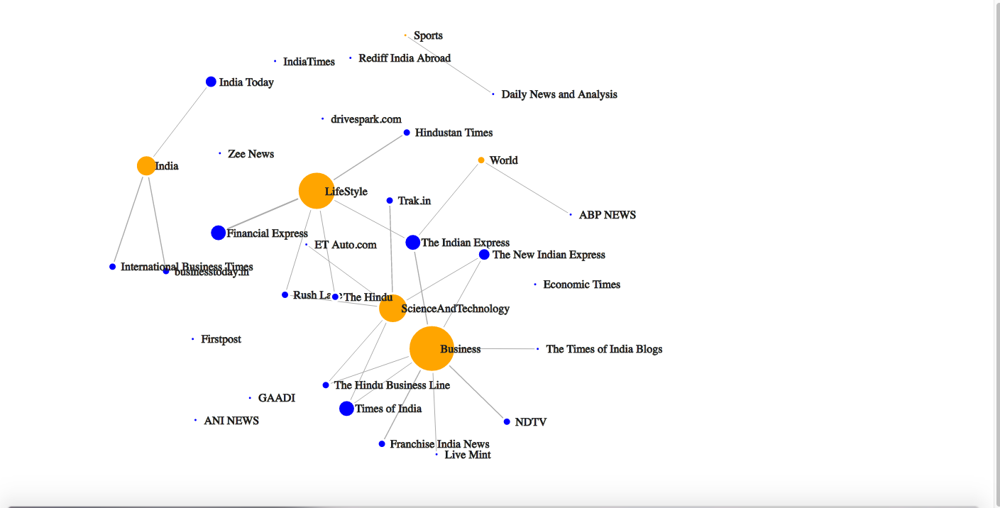
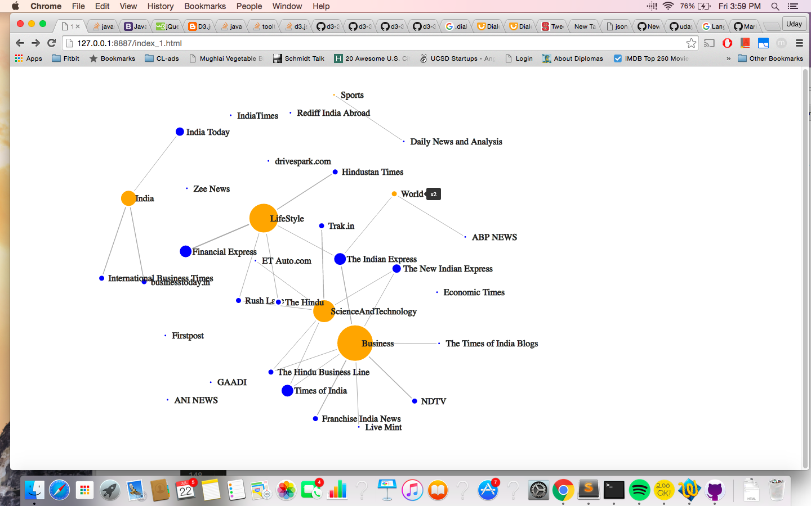
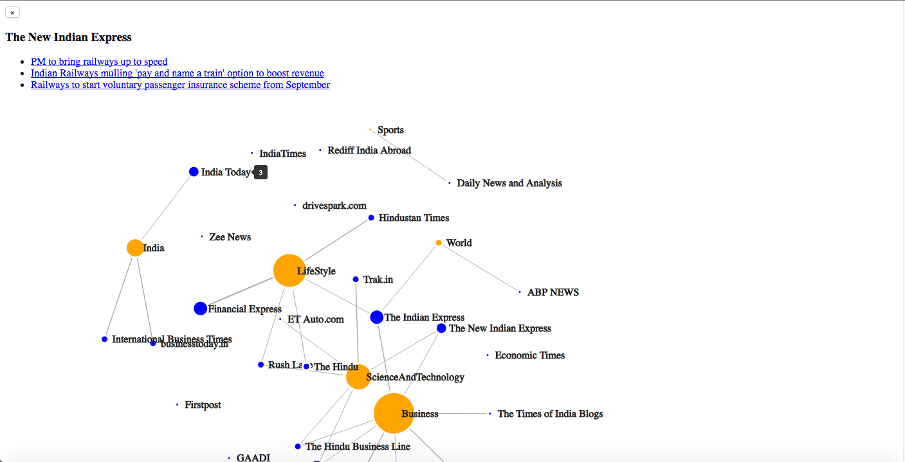

# Network_Graph
Simple Network Plot of Categories and the Sources of News articles in the Indian Railways 

## Screen shot 

#### Tooltip
Hovering on the Paricular Node shows the count of the articles belonnging to the category or organization in the tooltip 
 

#### Modal Effect 
Clicking on the Node item reveals the actual articles in a list with their URL link. 

 

 
 
 

_The data is taken from Microsoft Bing News Search API _.
